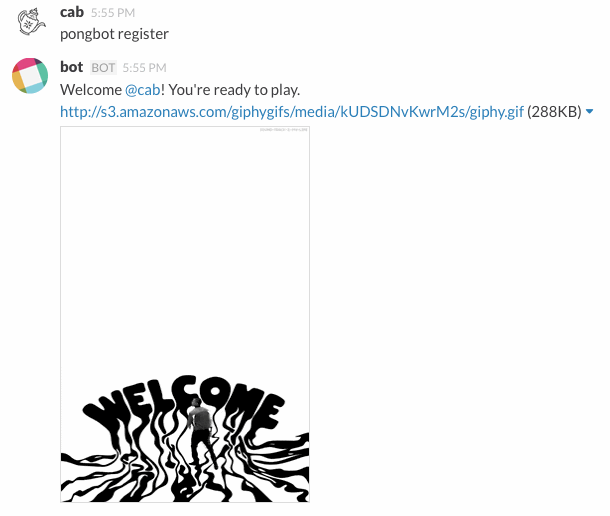

# Slack-Gamebot

[](http://playplay.io)

Or roll your own ...

[](https://travis-ci.org/dblock/slack-gamebot) [](https://codeclimate.com/github/dblock/slack-gamebot) [](https://gemnasium.com/dblock/slack-gamebot)

A generic game bot for slack. Works for ping-pong \(2, 4 or more players\), chess, etc. Inspired by [slack-pongbot](https://github.com/andrewvy/slack-pongbot), but more robust, generic and easier to improve and contribute to.


## Installation

Create a new Bot Integration under [services/new/bot](http://slack.com/services/new/bot). Note the API token. You will be able to invoke gamebot by the name you give it in the UI above.

Run `SLACK_API_TOKEN=<your API token> GAMEBOT_SECRET=secret foreman start`

## Production Deployment

See [DEPLOYMENT](deployment.md)

## Usage

Start talking to your bot!


### Commands

#### gamebot

Shows GameBot version and links.

#### gamebot hi

Politely says 'hi' back.

#### gamebot help

Get help.

#### gamebot sucks

You can tell the bot that it sucks. But it will talk back.


#### gamebot register

Registers a user.



This command can also update a user's registration, for example after the user has been renamed. The bot notices user renames, but this may be necessary if the bot wasn't running during that operation.

```text
gamebot register

Welcome back Victor Barna! I've updated your registration.
```

#### gamebot challenge &lt;opponent&gt; ... \[with &lt;teammate&gt; ...\]

Creates a new challenge between you and an opponent.

```text
gamebot challenge @WangHoe

Victor Barna challenged Wang Hoe to a match!
```

You can create group challenges, too. Both sides must have the same number of players.

```text
gamebot challenge @WangHoe @ZhangJike with @DengYaping

Victor Barna and Deng Yaping challenged Wang Hoe and Zhang Jike to a match!
```

#### gamebot accept

Accept a challenge.

```text
gamebot accept

Wang Hoe and Zhang Jike accepted Victor Barna and Deng Yaping's challenge.
```

#### gamebot lost \[to &lt;opponent&gt; \[with &lt;teammate&gt;\]\] \[score ...\]

Record your loss.


You cannot record a win.

Record your loss with a score, loser first.

```text
gamebot lost 5:21

Match has been recorded! Wang Hoe crushed Victor Barna with the score of 21:5.
```

You can record scores for an entire match.

```text
gamebot lost 15:21 21:17 18:21

Match has been recorded! Wang Hoe defeated Victor Barna with the scores of 21:15 17:21 21:18.
```

You can record scores for a match you have already lost.

```text
gamebot lost

Match has been recorded! Wang Hoe defeated Victor Barna.

gamebot lost 15:21 21:17 18:21

Match scores have been updated! Wang Hoe defeated Victor Barna with the scores of 21:15 17:21 21:18.
```

You can record a loss without a challenge.


You can also record scores and record lost matches with multiple players.

```text
gamebot lost to @WangHoe @ZhangJike with @DengYaping 5:21

Match has been recorded! Wang Hoe and Zhang Jike defeated Victor Barna and Deng Yaping with the score of 21:5.
```

#### gamebot draw \[score ...\]

Draws a challenge, records a tie. All other players will also have to draw to record a match.

```text
gamebot draw

Match is a draw, waiting to hear from Victor Barna.

gamebot draw 2:2

Match has been recorded. Victor Barna tied with Zhang Jike with a score of 2:2.
```

#### gamebot resigned \[to &lt;opponent&gt; \[with &lt;teammate&gt;\]\]

Records your resignation, which is a special kind of `lost` without a score.

```text
gamebot resigned

Match has been recorded! Victor Barna resigned against Wang Hoe.
```


You can resign without a prior challenge.

```text
gamebot resigned to WangHoe

Match has been recorded! Victor Barna resigned against Wang Hoe.
```

#### gamebot decline

Decline a challenge.

```text
gamebot decline

Wang Hoe and Zhang Jike declined Victor Barna and Deng Yaping's challenge.
```

#### gamebot cancel

Cancel a challenge.

```text
gamebot cancel

Victor Barna and Deng Yaping canceled a challenge against Wang Hoe and Zhang Jike.
```

#### gamebot leaderboard \[number\|infinity\]

Get the leaderboard.

```text
gamebot leaderboard

1. Victor Barna: 3 wins, 2 losses (elo: 148)
2. Deng Yaping: 1 win, 3 losses (elo: 24)
3. Wang Hoe: 0 wins, 1 loss (elo: -12)
```

The leaderboard contains 3 topmost players ranked by [Elo](http://en.wikipedia.org/wiki/Elo_rating_system), use _leaderboard 10_ or _leaderboard infinity_ to see 10 players or more, respectively.

#### gamebot matches \[number\|infinity\]

Displays top 10 match totals in the current season.

```text
gamebot matches

Victor Barna defeated Wang Hoe 3 times
Deng Yaping defeated Victor Barna once
```

You can also get match totals for specific players.

```text
gamebot matches @WangHoe

Victor Barna defeated Wang Hoe 5 times
Wang Hoe defeated Deng Yaping twice
```

Use _matches 3_ to see top 3 matches o _matches inifinity_ to see all matches in the season.

#### gamebot challenges

Displays all outstanding \(proposed and accepted\) challenges.

#### gamebot rank \[&lt;player&gt; ...\]

Show the smallest range of ranks for a list of players. If no user is specified, your rank is shown.

```text
gamebot rank @WangHoe @DengYaping

2. Deng Yaping: 1 win, 3 losses (elo: 24)
3. Wang Hoe: 0 wins, 1 loss (elo: -12)
```

#### gamebot promote &lt;player&gt; ...

Promotes other users to captain. Must be a captain to do that.

```text
gamebot promote @WangHoe @DengYaping

Victor Barna promoted Wang Hoe and Deng Yaping to captain.
```

#### gamebot demote me

Demotes from captain to a normal user. Must be a captain and the team must have other captains to do this.

```text
gamebot demote me

Victor Barna is no longer captain.
```

#### gamebot team

Display current team's info, including captains.

```text
gamebot team

Team _China_, captains Deng Yaping and Victor Barna.
```

#### gamebot reset &lt;team id\|team name&gt;

Reset all users and pending challenges and start a new season. Must be a captain to do this and confirm by specifying the team ID or name.

```text
gamebot reset china

Welcome to the new season!
```

#### gamebot season

Display current season's leader and game totals.

```text
gamebot season

Current: Deng Yaping: 1 win, 0 losses (elo: 48), 1 game, 2 players
```

#### gamebot seasons

Display current season's leader, past seasons' winners and game totals.

```text
gamebot seasons

Current: Deng Yaping: 1 win, 0 losses (elo: 48), 1 game, 2 players
2015-07-16: Wang Hoe: 28 wins, 19 losses (elo: 214), 206 games, 25 players
```

#### gamebot set gifs on\|off

Enable/disable GIFs for your team.

```text
gamebot set gifs off

GIFs for team China are off.
```


#### gamebot set aliases &lt;alias\|none&gt; ...

Set additional aliases for the bot. For example you could upload a custom emoji for :pong: and set an alias for it.

```text
gamebot set aliases pp :pong:

Team China aliases are set to pp and :pong:.
```

Remove all aliases with `set aliases none`.


#### gamebot set api on\|off

Enable/disable team data in the public API for your team.

```text
gamebot set api on

API for team China is on!
```

## API

Slack-gamebot implements a Hypermedia API. Navigate to the application root to browse through available objects and methods. PlayPlay.io's Gamebot is [here](http://bots.playplay.io), you can see [dblock's current ping-pong elo here](http://bots.playplay.io/users/5543f64d6237640003000000).

A team captain must opt-in serving data via the API with `set api on`. The data served by the API includes team's Slack IDs, usernames and game stats.


We recommend [HyperClient](https://github.com/codegram/hyperclient) to query the API programmatically in Ruby.

## Contributing

This bot is built with [slack-ruby-bot](https://github.com/dblock/slack-ruby-bot). See [CONTRIBUTING](contributing.md).

## Copyright and License

Copyright \(c\) 2015, Daniel Doubrovkine, Artsy and [Contributors](changelog.md).

This project is licensed under the [MIT License](license.md).

